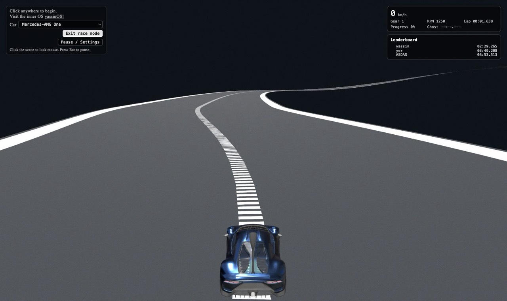
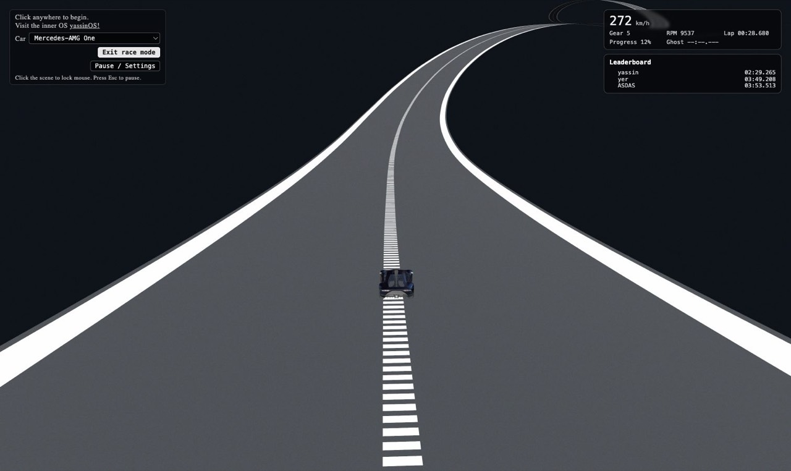
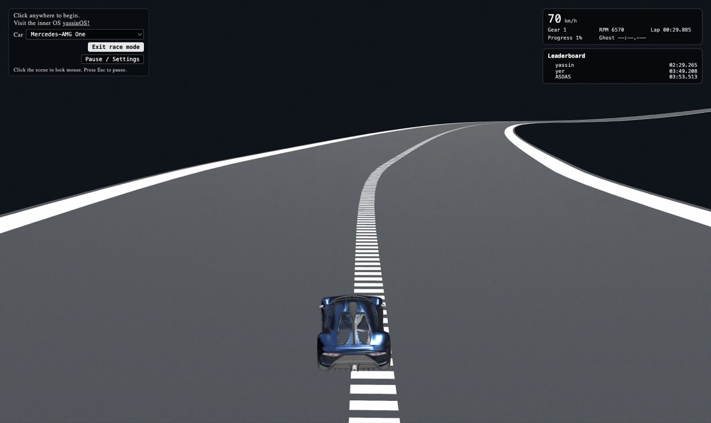
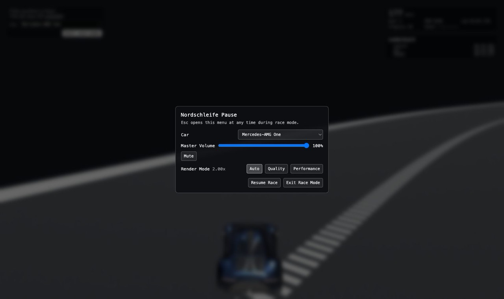
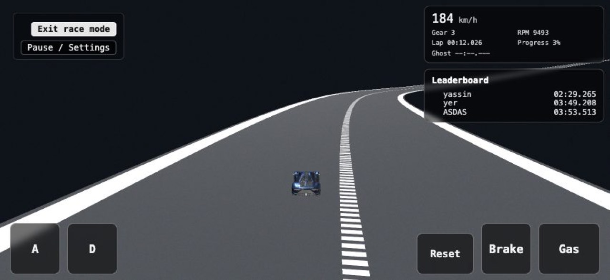
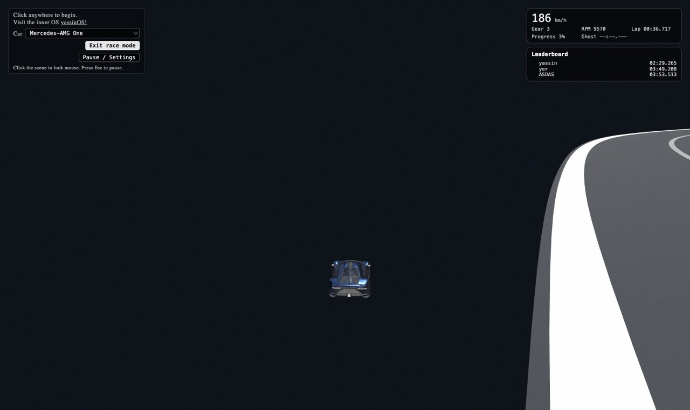

# Nordschleife racing: audit and redo plan

September 2026. Measured on the M5 MacBook Pro (10-core GPU) in Playwright's Chromium (build 1228,
ANGLE on Metal), headed, 1512x900 CSS px at 2x, against the production build served locally with the
`vercel.json` headers. Numbers below come from the tools in `scripts/` so they can be rerun:

| Tool | What it does |
|---|---|
| `scripts/race-playtest.mjs` | Headed Chromium play test. Loads the site, clicks Play Solo, drives with real key presses (an autopilot holds W/A/S/D/Space), and records load time, fps, frame times, pixel ratio, draw calls, console errors and screenshots. `--mobile` emulates a landscape phone. |
| `scripts/race-drive-metrics.js` | In-page driving bench on a flat test pad: 0-100, 0-200, top speed, 100-0 braking, skidpad grip at 60/100/150 km/h, step steer response, and a handbrake drift. |
| `scripts/race-harness-run.mjs` | Runs `race-physics-check.js` (the grounding and stability harness from PR #14) and the driving bench in Chromium and writes JSON. |

## Top findings

1. **The driving model has no grip limit, and every car drives the same.** Speed is a 1D value and yaw
   comes from a bicycle formula, so there are no tire forces at all. All nine cars do 0-100 in 3.75 s,
   top out at 300 km/h (the Toyota Crown included) and stop from 100 km/h in 8.9 m, which is 4.4 g.
   The per-car power, mass, gearing and brake data in `carOptions.ts` is only used for the rev
   counter. Cornering grip rises with speed (0.9 g at 60 km/h, 1.6 g at 100, 2.9 g at 150) and the
   car never slips, so the fastest way around is full throttle everywhere. The current record
   (2:29.3) is basically a flat-out lap.
2. **Steering is laggy and weaves.** A steering step takes 0.5 to 0.6 s to reach 63% of its yaw
   rate and 1.1 to 1.3 s to reach 90%. The first keyboard autopilot weaved off the road at 170 km/h
   with growing corrections, which is what a person does too. It only held the road once it damped
   its own yaw rate.
3. **The track is a 36 m wide highway through a void.** The road is about four times the real
   ring's width, and the 128-point centerline rounds off the corners: the tightest radius is 50 m
   and 97% of the lap is above 200 m. At a realistic 1.2 g the whole lap averages 254 km/h. There is
   no ground, barrier or scenery outside the road, so leaving it drops the car into black space.
   After five failed recoveries it resets to the start with the lap timer still running.
4. **Nothing is lit or graded.** Race mode reuses the room's hemisphere and two directional lights
   and the room's cube map for car reflections, on a flat `#0b0f14` background with fog. There are
   no shadows, no sky, no tone mapping and no post-processing. The center dashes shimmer into a
   barcode in the distance and the edge lines are 2.3 m wide.
5. **The camera hides the speed.** It sits 11 to 21 m behind and 4 to 8 m up, so the car is small
   and the road has no close detail to stream past. At 272 km/h the road barely seems to move. Shake is added
   straight into the smoothed position, and FOV widens with speed but nothing else reacts.
6. **The HUD is a text box.** Speed, gear, RPM, lap and progress sit in a row of spans. No tach, no
   sector splits, no delta, no minimap. The ghost only exists with `?ghostReplay` in the URL. The
   whole site panel stays on screen while racing.
7. **The engine is three oscillators at crank speed.** It plays sine and triangle waves at
   `rpm/60` times 0.34, 0.81 and 1.42 plus fixed offsets, so the partials aren't harmonics of each
   other (they beat like a synth pad) and the pitch is about a quarter of a real V8, which fires
   four times per crank revolution (467 Hz at 7000 rpm). No turbo, exhaust, scrape or impact sounds.
8. **Performance is not the problem yet.** 124 fps average at 2x (the display is 120 Hz), 66 draw
   calls, 96K triangles, 1.2 ms of JS per frame. There is a lot of headroom to spend. The one real
   issue is a 0.7 to 2.4 s freeze when entering race mode (one long frame, then a few 100 to 300 ms
   frames from shader compiles).

## Current game: measurements

### Load and frame rate

| | Desktop, Render Mode Auto | Mobile emulation (852x393 @3x) |
|---|---|---|
| Loading screen done | 1.3 to 2.1 s (local, no throttling) | 1.7 s |
| Initial transfer | 7.8 MB | 7.8 MB |
| Main bundle | 995 KB (273 KB gzip) | same |
| Racing chunk + Supabase chunk | 155 KB + 170 KB (40 + 44 KB gzip) | same |
| Race entry download | 87 KB (the default car is preloaded) | 87 KB |
| Other cars on first pick | 0.6 to 6.5 MB each (GLB) | same |
| Race entry stall | worst frame 0.7 to 2.4 s | similar |
| fps mean / 1% low | 124 / 75 | 123 / 73 (desktop GPU) |
| Frame time p50 / p99 | 8.1 / 13.3 ms | |
| Pixel ratio (Auto) | 1.75 to 2.0 | 1.15 to 2.0 |
| Draw calls / triangles | 66 / 96K | |

### Driving bench (`race-drive-metrics.js`)

| Car | 0-100 | Top speed | 100-0 | Skidpad 60 / 100 / 150 km/h | Step steer t63 | Handbrake at 80 |
|---|---|---|---|---|---|---|
| AMG One | 3.75 s | 300 | 8.9 m | 0.87 / 1.56 / 2.83 g | 0.48 s | no slide |
| E92 M3 | 3.75 s | 300 | 8.9 m | 0.89 / 1.61 / 2.91 g | 0.48 s | 18 deg, no hold |
| C63 507 | 3.75 s | 300 | 8.9 m | 0.87 / 1.57 / 2.85 g | 0.48 s | 18 deg |
| C63 S | 3.75 s | 300 | 8.9 m | 0.87 / 1.56 / 2.83 g | 0.48 s | 18 deg |
| F82 M4 | 3.75 s | 300 | 8.9 m | 0.88 / 1.59 / 2.88 g | 0.48 s | 18 deg |
| M5 Comp | 3.75 s | 300 | 8.9 m | 0.82 / 1.49 / 2.70 g | 0.48 s | 12 deg |
| M8 Comp | 3.75 s | 300 | 8.9 m | 0.84 / 1.52 / 2.76 g | 0.48 s | 12 deg |
| GT63 S | 3.75 s | 300 | 8.9 m | 0.81 / 1.47 / 2.66 g | 0.48 s | 12 deg |
| Crown | 3.75 s | 300 | 8.9 m | 0.71 / 1.28 / 2.32 g | 0.48 s | no slide |

For scale, the real cars range from a 208 km/h hybrid sedan to a 352 km/h hypercar, a road car stops
from 100 km/h in 33 to 37 m, and street tires hold about 1.0 g at any speed.

### Stability harness (`race-physics-check.js`, all nine cars, 30 s at up to 300 km/h)

These are the guarantees from PR #14 that the redo has to keep:

| Metric | Result |
|---|---|
| Gap at rest | 0 to +0.4 cm |
| Worst wheel sink at speed | -1.3 to -2.5 cm |
| Steps with a wheel sunk more than 5 cm | 0% |
| Highest wheel p95 | 3.5 to 5.0 cm |
| Airborne / off track | 0% / 0% |
| Tilt jitter (max per step) | 0.10 to 0.11 deg |
| Recoveries in normal driving | none |
| Handbrake + full lock at 200 km/h | 93 deg/s, 16 m/s sideways, 20 deg slip, no spin |

### Track (`NordschleifeTrack.ts`)

| | Value |
|---|---|
| Lap length | 10.74 km (the real ring is 20.8 km, the data is squeezed to 0.475) |
| Road / collider width | 36 m / 42 m |
| Tightest radius | 50 m (5th percentile 279 m) |
| Lap share with radius under 100 m / 200 m | 1% / 3% |
| Elevation range / total climb | 169 m / 504 m |
| Point-mass lap at 1.2 g lateral, 1.1 g braking | 2:32, average 254 km/h, slowest corner 87 km/h |

## Current game: problems by area

### Visuals
- Black void around a grey ribbon. No sky, terrain, trees, barriers, kerbs, signs or start gantry.
- Lighting is the room's: hemisphere 0.55, key 1.0 and rim 0.4 directional lights, and the room's
  cube map in the car paint. No shadow maps are enabled anywhere, so the car has no shadow on the
  road (the contact shadow only exists on the site view's car).
- No tone mapping, no bloom, no anti-aliasing beyond MSAA on the default framebuffer.
- Center dashes alias badly past about 40 m. Edge lines are 13% of the half width, so 2.3 m wide.
- The asphalt is one 256 px canvas texture repeated 95 times, so it tiles visibly.
- Drift smoke creates a new `SpriteMaterial` for every particle, and only when the (rare) drift
  state triggers.

### Driving feel
- No tire model (see the bench). No weight transfer, no load sensitivity, no understeer or
  oversteer, no wheelspin or lockup, no reason to brake.
- The per-car data is ignored for dynamics: `SHARED_TOP_SPEED_KPH`, `SHARED_ZERO_TO_HUNDRED_SEC`,
  `SHARED_BRAKE_DECEL` and `SHARED_MAX_STEER_ANGLE_DEG` apply to every car.
- Keyboard steering goes through two smoothing stages (input `dt*8`, then steer angle
  `dt*12*0.132`), which is where the 0.5 s lag comes from. Max steer is 4.5 degrees (9 at walking
  pace).
- Drift is a scripted state (`driftAmount`) that blends a lateral velocity in, gated by RWD and
  handbrake plus throttle plus steer. AWD cars can't slide at all.
- No gamepad support. No reset key (only the mobile Reset button).

### Camera
- Too far and too high for a sense of speed, and the car sits in the middle of the frame.
- Smoothing is `lerp(dt*8)` on position and look target, so it lags the same amount in every axis.
- Shake is two sines added into `smoothPosition`, so it gets filtered and fed back.
- No camera collision with anything but the car body, no alternative views.

### Audio
- Engine: three oscillators with inharmonic partials at a quarter of the real firing frequency,
  through bandpass filters. Per-car profiles only change base frequencies and gains.
- Tire squeal is one bandpass noise, wind and road are filtered noise. No turbo, exhaust pops,
  scrapes, impacts, kerb rumble or shift sounds beyond a soft triangle blip.

### UI and UX
- The HUD is text only, with no tach, shift light, sector times, delta to best, minimap or lap toast.
- Ghosts are hidden unless the URL has `?ghostReplay`.
- The site panel (car picker, yassinOS link, Exit, Pause) stays on screen while racing, and "Click
  the scene to lock mouse" stays up until you do.
- No onboarding for controls, no reset or restart keys, no countdown or "cross the line to start".
- Off-track recovery can reset you to the start without restarting the lap timer.

### Mobile
- Touch steering buttons are labeled "A" and "D". There is no handbrake button even though the
  input code supports one.
- The HUD and leaderboard take a third of a landscape phone screen, and the car is tiny.
- The site panel covers most of the room view on phones before racing.

### Performance and tech
- three.js r137 (early 2022) with legacy lighting units and no color management. PR #2 (r182) is
  blocked on the Draco decoder, `sRGBEncoding` and untyped API changes.
- The race entry freeze: about 140 ms to load and build the race manager, a 460 ms first update and
  a 190 ms first render (shader compiles), and up to 2.4 s on a cold cache.
- Leaving the road is handled by fall recovery (up to five retries) instead of by barriers.

## Reference sites

Screenshots of these sites are kept out of this public repo. Everything below is a description for
inspiration only. None of their code, shaders, models, textures or audio is used.

| Site | three.js | Transfer | fps (M5, 2x) |
|---|---|---|---|
| [Shopify Editions Summer '25: Horizon Drive](https://www.shopify.com/ca/editions/summer2025/drive) | r172 | 8.2 MB (3.3 MB models, 3.3 MB audio) | 58 to 60 |
| [Slow Roads](https://slowroads.io/) | r155 | 38 MB (26 MB is the landing video) | 58 to 59 |
| [PolyTrack](https://www.kodub.com/apps/polytrack) | r181 | 4.3 MB (1.5 MB audio, 83 KB wasm) | 59 to 60 |
| [Bruno Simon's portfolio](https://bruno-simon.com/) | r183 (WebGPU/TSL) | 7.3 MB (1.9 MB audio) | 59 to 60 |
| [mrdoob's Starter Kit Racing](https://mrdoob.github.io/Starter-Kit-Racing/) | r185 | 0.7 MB | 59 to 60 |

All five are capped at 60 fps or close to it; ours runs at 124 because there is almost nothing to draw.

### Shopify Horizon Drive
- **Look:** one strong art direction. A synthwave sunset (magenta to orange gradient sky, a huge sun
  disc), low-poly palms, houses, towers, boats and balloons packed along the road, and distance fog
  tinted to the sky so everything melts into the horizon.
- **Lighting and post:** flat stylized shading with colored ambient, and bloom doing most of the
  work: neon road edge strips, lamp posts, chevron signs, tail lights and a glowing rim on the tires
  all bloom.
- **Camera:** low and close (the car fills the lower third), horizon a bit above center, and it
  swings wide in turns so you see the car's side as it slides.
- **Speed and particles:** long orange spark streaks when you scrape the barrier, and the road edge
  lights stream past close to the camera. Walls keep you on the road.
- **UI:** almost nothing. Lap time top left, sound and exit top right, and a segmented arc gauge
  with a big digital speed bottom right, all in one display font.
- **Audio:** sampled: an engine loop, car start, a tire drift loop, a rail scrape loop, boosts,
  ramps, splashes, crowd and a music track per zone.
- **Driving:** the weak spot, as Yassin said. The car sticks to walls and grinds along them at
  25 to 30 mph, and steering feels like it's on rails until it isn't.

### Slow Roads
- **Look:** realistic and calm. Procedural rolling terrain with grass, instanced trees, dry stone
  walls and Armco along the road, double center lines, real-width lanes, and aerial perspective
  that turns distant hills blue.
- **Camera:** close chase with a small steering indicator (a curved white line under the car shows
  how much you're steering), which is a clever fix for keyboard steering being invisible.
- **UI:** two numbers (distance and speed) in thin text, everything else hidden in a bottom bar.

### PolyTrack
- **Look:** clean low-poly with red and white kerbs, black walls, directional shadows and a cloud
  skybox. Readable at a glance.
- **UI:** the best racing UI of the set. Record, Current and Difference timing at the bottom, a
  checkpoint counter, speed, and a big 3D arrow to the next checkpoint. Contextual hints appear
  when you need them ("Press R to return to the last checkpoint, T to start over").
- **Audio:** separate engine, suspension, tire, skid, collision, checkpoint and record sounds.
- **Structure:** checkpoints, instant reset to the last checkpoint, replays and ghosts.

### Bruno Simon's portfolio
- **Look:** a warm toon world with dense interactive grass, rim lighting, glowing lanterns,
  falling leaves and a tilt-shift blur at the top and bottom of the frame that makes it read like a
  miniature.
- **Relevance:** the same genre as ours (a portfolio you drive around), and proof that polish comes
  from lots of small touches layered together, not one big feature.

### Starter Kit Racing (mrdoob)
- **Look:** a toy track with soft shadows from instanced trees, kerbs, a start arch and tire smoke,
  in 0.7 MB total. A good reminder that a small download can still look finished.
- **UI:** one compact panel: lap number, current time, last and best.

### What we take from them
- One coherent look instead of a default one: a golden hour Eifel palette (warm low sun, blue haze,
  dark green forest) that suits realistic car models better than a stylized one.
- Bloom and emissive accents for highlights (sun, tail lights, lamps), fog and haze tied to the sky.
- A close, low chase camera that reacts to speed and slides, and close-by geometry (barriers,
  posts, kerbs, trees) streaming past for speed.
- Sparks on barrier contact, smoke that looks like smoke, skid marks.
- PolyTrack's timing UI (current, best, delta, sectors), reset to checkpoint, contextual hints.
- Slow Roads' steering indicator for keyboard players.
- A small download: generate geometry and textures at runtime instead of shipping them.
- And the part none of them do well: a driving model with real grip, weight and car differences.

## Ranked gaps

| # | Gap | Why it matters | Fix | PR |
|---|---|---|---|---|
| 1 | No tire model, identical cars | It's the whole game: no braking, no skill, no reason to try another car | Tire forces with weight transfer, load sensitivity, drivetrain and per-car data | Driving |
| 2 | 36 m road in a void | Kills speed and precision, leaving the road is a fall | 16 m road, verges, Armco barriers with collision, terrain | Driving + Visuals |
| 3 | No lighting, sky or grading | Reads as a prototype | Sun, sky, image based lighting from the sky, shadows, tone mapping, bloom | Visuals |
| 4 | Camera far and high | No sense of speed | Close spring chase cam, FOV kick, shake from speed and surface | Camera/HUD/Audio |
| 5 | Laggy keyboard steering, no gamepad | Hard to control, weaving | Speed-sensitive steering limit, fast ramp, countersteer assist, Gamepad API | Driving |
| 6 | Empty environment | Nothing streams past, no depth | Instanced trees, posts, kerbs, markings, gantry | Visuals |
| 7 | Text HUD, hidden ghost | No feedback on how you're doing | Tach and speed gauge, sectors and delta, minimap, ghost toggle, lap toast | Camera/HUD/Audio |
| 8 | Synth drone engine | Sound is half of speed | Firing-frequency engine synthesis per car, turbo, pops, squeal, scrape | Camera/HUD/Audio |
| 9 | Race entry freeze | First impression | Build and compile ahead, async shader compile | Visuals |
| 10 | three r137 | Blocks modern color and post tools | Upgrade to r186 | three.js |
| 11 | Low-res centerline | Corners are rounded off | Denser track data (follow-up, see below) | Later |

## The three.js upgrade: yes, first

The redo should include a proper upgrade to r186, as its own PR before the visual work:

- **The visual redo is a lighting and color redo.** On r137 there is no color management and lights
  use legacy units, so every color and intensity tuned there would have to be tuned again when the
  upgrade finally lands. PR #2 has been open since January and the upgrade isn't going away.
- **What r186 gives the redo directly:** color management and physically based light units (so an
  HDR sky environment and PBR car paint behave predictably), AgX and Neutral tone mapping (better
  highlight rolloff on paint and sky than r137's ACES fit), `OutputPass` for correct tone mapping
  and sRGB at the end of a post chain, multisampled half float render targets for MSAA inside the
  post chain, and `compileAsync` to compile shaders without freezing the page on race entry.
- **The cost is known and bounded.** PR #2's comment already lists it: update the Draco decoder,
  move `encoding` to `colorSpace`, bump `@types/three`, rescale the room scene's light intensities
  by pi, and convert the hand-tuned hex colors (paint, trim, tint) so they keep their current look
  under color management. The room is baked and unlit (`MeshBasicMaterial`), so it should render
  the same, and that can be checked with pixel diffs.
- **Risk is contained to one PR.** It gets its own before/after screenshots of the room, all nine
  cars and race mode, and nothing in the redo depends on it except the visuals PR.

Staying on r137 would still allow a post chain (r137 has `EffectComposer`, `UnrealBloomPass` and
ACES), but it means writing our own output pass, living without MSAA in render targets and async
compiles, and paying the migration later on top of a freshly tuned scene.

## Redo plan

Stacked PRs, each with typecheck, build, the physics harness, fps in headed Chromium on the M5,
before/after screenshots, a console check and a live leaderboard check.

1. **Audit and tools** (this PR). This document, `race-playtest.mjs`, `race-drive-metrics.js`,
   `race-harness-run.mjs`.
2. **three.js r186.** Supersedes #2. Draco decoder, color spaces, light units, types, and pixel
   checks that the site looks the same.
3. **Driving model.**
   - Four wheel tire model (combined slip, load sensitivity), weight transfer, yaw inertia.
   - Engine torque curves, gears with shift times, differential, aero drag and downforce, brakes
     with bias, ABS, traction control and a stability assist (all optional).
   - Per-car data from published specs (power, torque, mass, drivetrain) tuned to each car's
     0-100 and top speed.
   - Keyboard steering with a speed-sensitive limit and countersteer assist, gamepad support,
     reset keys.
   - 16 m road with verges and barrier collision. The harness guarantees stay.
4. **Visuals.**
   - Golden hour sun and sky, image based lighting from the sky, shadows that follow the car.
   - Post chain: MSAA, bloom, AgX, and speed effects (radial blur and chromatic aberration at the
     edges).
   - Terrain, instanced forest, Armco, kerbs, road markings, start gantry, better asphalt, car paint
     with clearcoat, tire smoke, sparks and skid marks.
   - Faster race entry. Tied into adaptive resolution and the existing render modes.
5. **Camera, HUD and audio.**
   - Spring chase cam with FOV kick and shake, alternative views.
   - Tach and speed gauge, lap and sector timing with delta, minimap, polished leaderboard, ghost
     toggle, onboarding, better touch controls.
   - Synthesized per-car engine, turbo, exhaust, tire squeal, scrape and impact sounds.

### Follow-ups outside this redo
- **Track data v2.** 128 control points can't describe the real corners: the ring's slow corners
  (Aremberg, Adenauer Forst, the Karussell) are much tighter than the 50 m minimum here. A denser
  centerline derived from OpenStreetMap (ODbL, needs attribution) and SRTM elevation would bring
  back the ring's character. It changes lap times again, so it should be its own leaderboard
  season.
- **Leaderboard seasons.** New physics and a narrower road make old laps incomparable. The driving
  PR tags new laps so the board starts fresh without touching the Supabase schema; old rows stay in
  the table.
