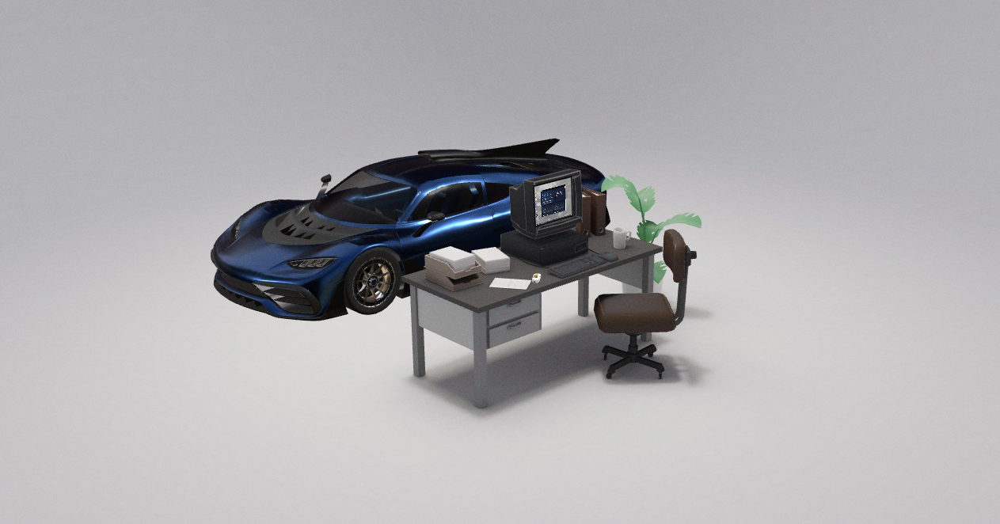

# yassin.app

Interactive 3D personal portfolio (outer layer) for https://yassin.app.

This project is built as a Three.js experience with a scene authored in Blender, deployed via containers on my homelab.

## Preview



## Credits / Inspiration

- Outer site baseline: Henry Heffernan’s portfolio foundation  
  https://github.com/henryjeff/portfolio-website  
  (Henry: https://twitter.com/henryheffernan)

- The “inner OS” experience (yassinOS) is based on Dustin Brett’s DaedalOS  
  https://github.com/DustinBrett/daedalOS

## Related Project

- **yassinOS (inner OS / web-OS):** https://github.com/yassinsolim/yassinOS

## Tech Overview

- **Frontend:** Three.js / WebGL experience (React-based stack depending on your setup)
- **Scene authoring:** Blender → exported to GLB/GLTF
- **Deployment:** Docker + reverse proxy (Caddy) + CI/CD (GitHub Actions)

## Local Development

Install dependencies:

```bash
npm install
```

Run the dev server:

```bash
npm run dev
```

## Exporting the Scene (GLB/GLTF)

Auto-export the scene to GLB (Windows):

```bash
npm run export:glb
```

If your dev server is running, you can export via URL:

```text
http://localhost:PORT/?export=1&save=1
```

Exported file location:

```text
exports/exported-scene.glb
```

## Notes

If you find bugs or have feature ideas, feel free to open an issue or message me.
