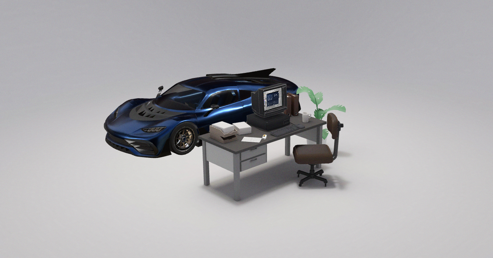

# yassin.app

Interactive 3D personal portfolio (outer layer) for https://yassin.app.

This project is built as a Three.js experience with a scene authored in Blender, deployed via containers on my homelab.

## Preview



## Play the Nordschleife

After the room loads, one click starts a solo lap: **Play Solo** on the room panel, the **Play Solo** tag on the car, or **Play Solo** on the monitor. That lap does not stop on the multiplayer card. Create Lobby and Join are separate buttons. Car meshes stay third-party and are credited on the page. This repository does not relicense them.

## Credits / Inspiration

- Outer site baseline: Henry Heffernan's portfolio foundation  
  https://github.com/henryjeff/portfolio-website  
  (Henry: https://twitter.com/henryheffernan)  
  MIT, Copyright 2024 Henry Heffernan. The root `LICENSE` keeps that notice and adds one for the newer work.  
  Still from that repo, byte for byte: the environment map in `static/textures/environmentMap/`. The studio backdrop mesh comes from his `environment.glb`, re-baked inside the room v2 models. The desk, monitors, and PC in room v2 are new. Detail is in `CREDITS.md`.

- The inner OS (yassinOS) is based on Dustin Brett's daedalOS  
  https://github.com/DustinBrett/daedalOS  
  MIT. It is a separate repository, embedded on the main monitor.

## Related Project

- **yassinOS (inner OS / web-OS):** https://github.com/yassinsolim/yassinOS

## Tech Overview

- **Frontend:** Three.js / WebGL experience (React-based stack depending on your setup)
- **Scene authoring:** Blender → exported to GLB/GLTF
- **Deployment:** Vercel

## Local Development

Install dependencies:

```bash
npm install
```

Run the dev server:

```bash
npm run dev
```

## Racing Leaderboard (Optional Supabase)

Online leaderboard setup is documented in `docs/RACING_SUPABASE.md`.
If Supabase config is not provided, leaderboard automatically falls back to localStorage.
On Vercel, set `NORDSCHLEIFE_SUPABASE_URL` and `NORDSCHLEIFE_SUPABASE_PUBLISHABLE_KEY` (the racing game's own Supabase project) before deploying; the schema is `supabase/racing.sql`.

## Exporting the Scene (GLB/GLTF)

Auto-export the scene to GLB (Windows):

```bash
npm run export:glb
```

If your dev server is running, you can export via URL:

```text
http://localhost:PORT/?export=1&save=1
```

Exported file location:

```text
exports/exported-scene.glb
```

## Notes

If you find bugs or have feature ideas, feel free to open an issue or message me.
